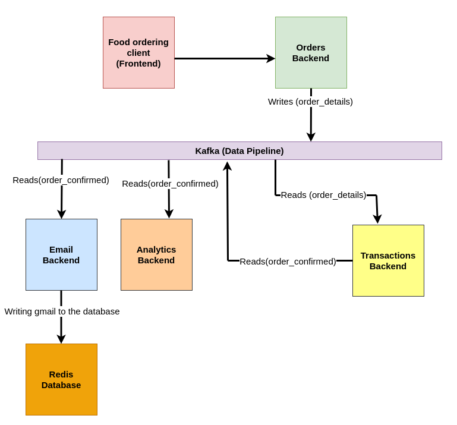

**Run:**
``` 
docker compose up 
```
**Attention! run each python file in a separate terminal window, or with Tmux.  
To make it work, you need to run all the python files I listed below. Each file in a separate terminal.**
```
python3 transaction.py
```
```
python3 analytics.py
```
```
python3 mail.py
```
```
python3 order_backend.py
```


Here I am developing a highly scalable backend system for a food ordering application. The system is event-driven. Every important thing is an event, such as order placement and order confirmation. 

These events are recorded in Apache Kafka, which is the central bus for all moving data. Other systems, such as a transaction system or email system, will be built on top of Apache Kafka. They will subscribe to various Kafka topics that interest them, and process them in real time as those messages are written to Kafka. 
We use the kafka-python library to connect a locally running Kafka broker and our Python code. 

The system needs to be well scalable. Given its decoupled nature, you can scale up or down individual components as needed. These individual components can either be microservices, or some kind of threading task, or just plain Python files, as I do here. 

The system is also very extensible due to the nature of Apache Kafka. Messages for a given thread can be stored inside Kafka. This means that if you want to create a new component, you can replay all the theme messages from the beginning and have the component handle all the messages from the beginning of the theme. 

Similarly, given Kafka's persistence, if there is a problem with any downstream or upstream system, you will not suffer from data loss.


